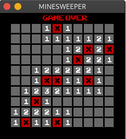

# Minesweeper

Jogo do Campo Minado feito em C++ e SDL2. 




## Começando

Com essas instruções você obterá uma cópia do projeto e as suas dependências. E como executar o jogo em seu sistema (feito no Linux).

### Pré requisitos

Ter instalado:

* [Git](https://git-scm.com/downloads)*
* [SDL2](https://lazyfoo.net/tutorials/SDL/01_hello_SDL/linux/index.php) - Tutorial de como instalar a biblioteca SDL2.
* SDL2-ttf:
```
sudo apt-get install libsdl2-ttf-dev
```

*Ou baixar o código no botão verde no topo da página e extrair os arquivos.

### Instalando

Clonar o repositório:

```
git clone https://github.com/MatheusBurda/MineSweeper.git
```

Ou baixar o código no botão verde no topo da página e extrair os arquivos.

## Compilando e executando

No diretório do projeto:

```
make all
./minesweeper
```

Pedirá alguns parâmetros para iniciar o jogo, como quantidade de bombas, linhas e colunas, é só preencher e apertar enter.

## Jogando: 

* Botão esquerdo do mouse: Abre um quadrado.
* Botão direito do mouse: Coloca uma flag. 
* Você deve colocar uma flag em todas as bombas para ganhar.
* Se abrir uma bomba você perde o jogo.
* Ao acabar, clicar em qualquer posição da tela inicia um novo jogo. 


## Autor

* **[Matheus Burda](https://github.com/MatheusBurda)** - *começo ao fim* 

## Licença

This project is licensed under the MIT License - see the [LICENSE.md](LICENSE.md) file for details
